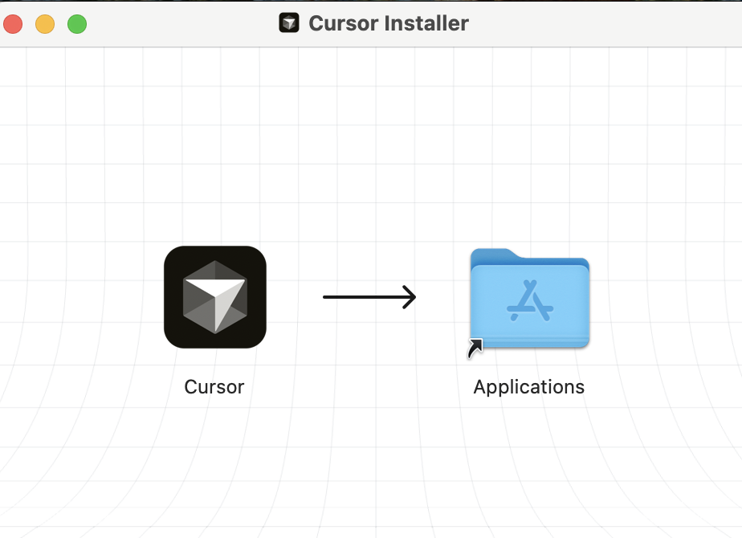
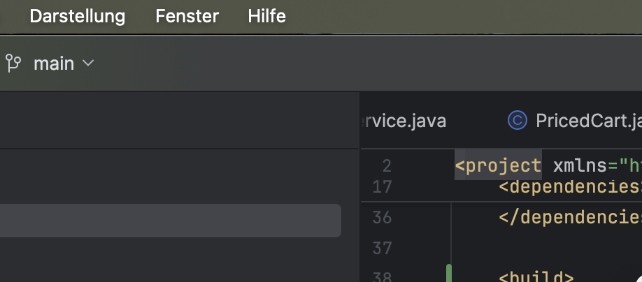
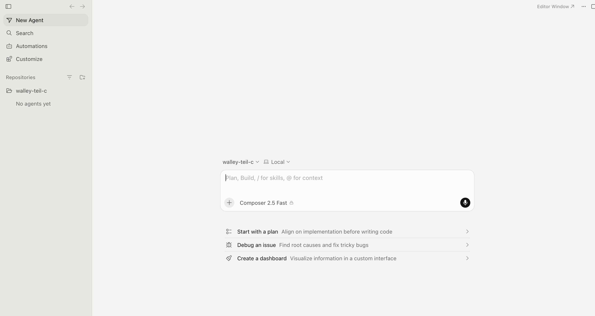
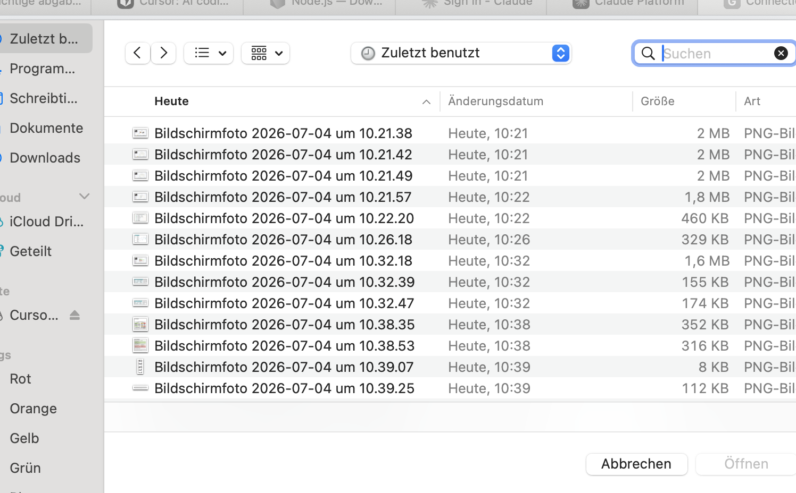
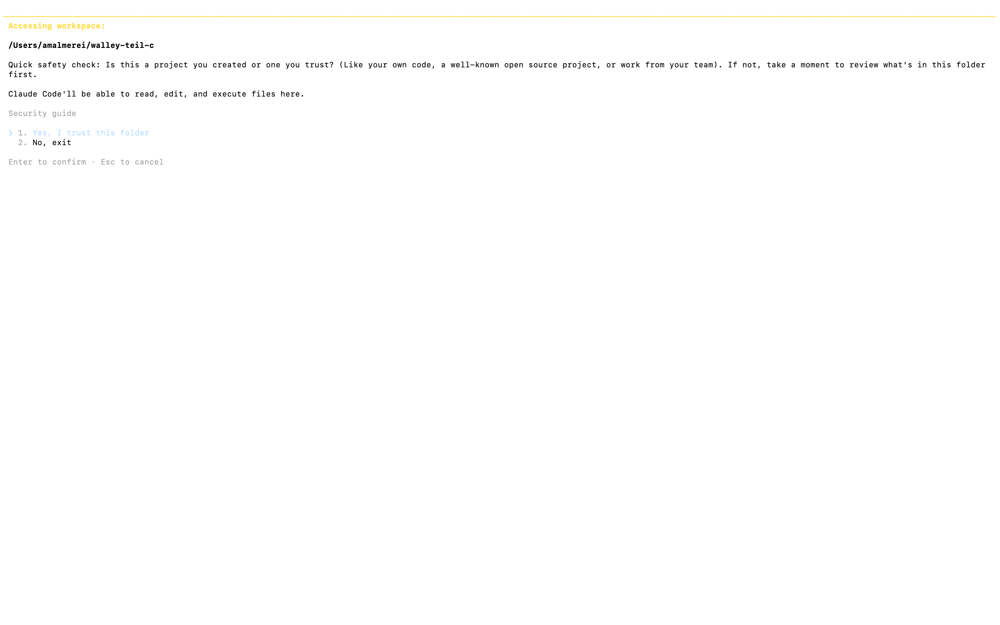
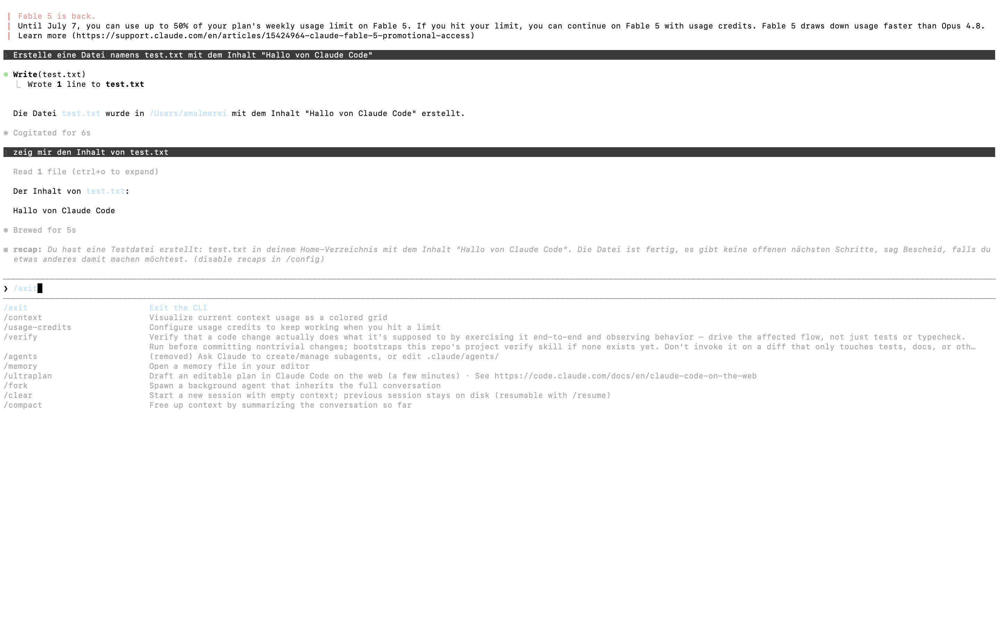
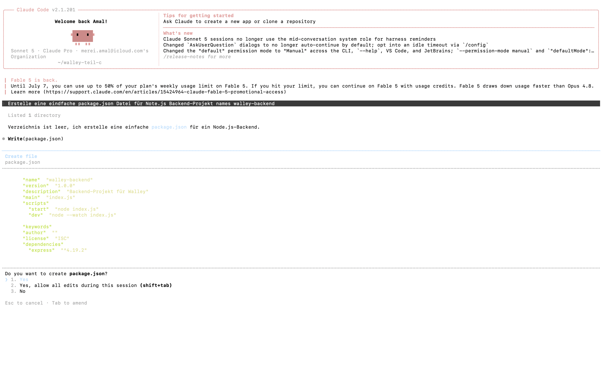

# Teil C – Werkzeuge und Installation
Amal Merei · Matrikel 107771 · Softwaretechnik (BHT MIB 20 S26)
## Anforderung laut Aufgabenstellung
Ein Hauptwerkzeug benutzen: entweder eine CLI oder ein VS-Code-Klon.
Das andere Tool auch mal installieren und benutzen, als Beweis.
## Verwendete Werkzeuge
### Hauptwerkzeug: Cursor
Cursor ist ein VS-Code-Klon mit eingebauter KI-Unterstützung. Er wurde als
Hauptwerkzeug für die gesamte Entwicklung von Teil C genutzt:
- Anlegen des Projektordners walley-teil-c
- Schreiben und Bearbeiten von index.js (Backend)
- Nutzung des integrierten Terminals für alle node- und npm-Befehle
Installation: Cursor wurde bereits vor Beginn von Teil C installiert
(heruntergeladen von cursor.com).

### Zweites Werkzeug: Claude Code
Claude Code ist ein CLI-Werkzeug (Kommandozeilen-Programm) von Anthropic,
das KI-gestützte Code-Bearbeitung direkt im Terminal ermöglicht. Es wurde
zusätzlich installiert und benutzt, als Nachweis für das zweite geforderte
Tool.

Claude Code wurde direkt im Projektordner walley-teil-c gestartet:

Als erster Test wurde Claude Code gebeten, eine Datei zu erstellen und
wieder auszulesen:

Anschließend wurde Claude Code auch für echte Projektarbeit genutzt, zum
Beispiel zum Erstellen der package.json:

## Fazit
Damit ist die Anforderung erfüllt: Ein Werkzeug (Cursor) wurde durchgängig
als Hauptwerkzeug für die gesamte Entwicklung genutzt, ein zweites
Werkzeug (Claude Code CLI) wurde zusätzlich installiert und benutzt, um
den Nachweis zu erbringen.