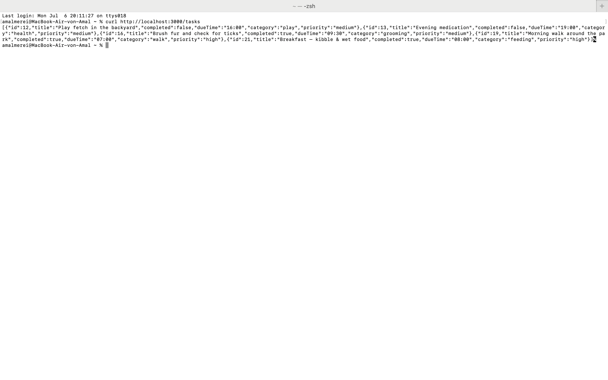
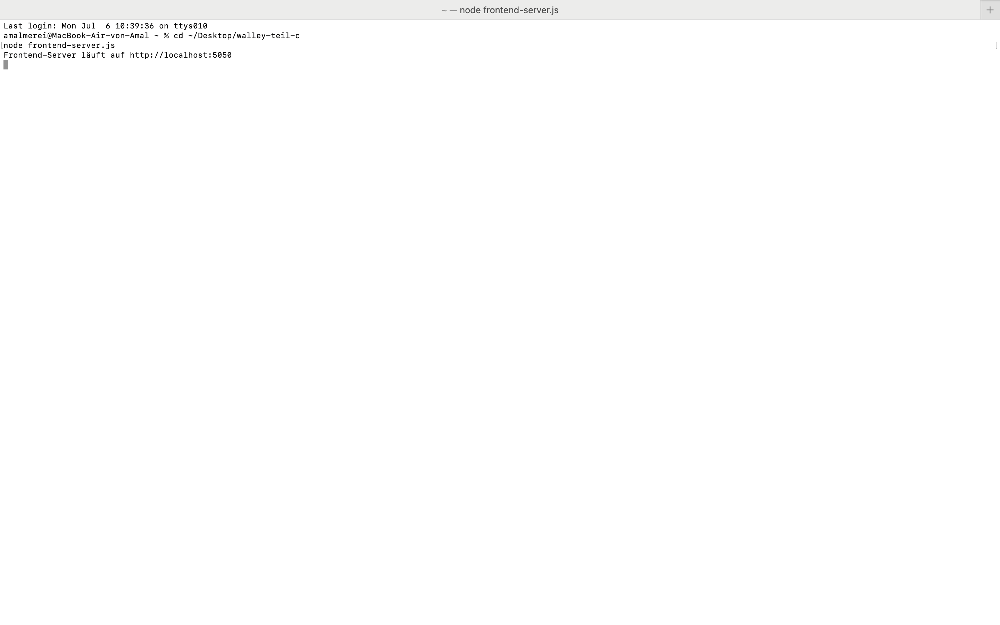
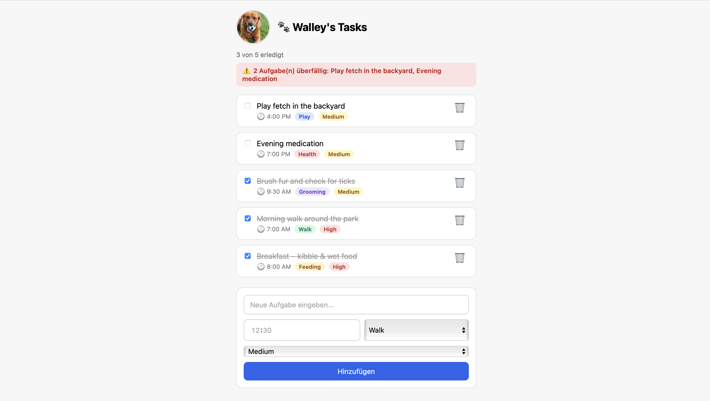
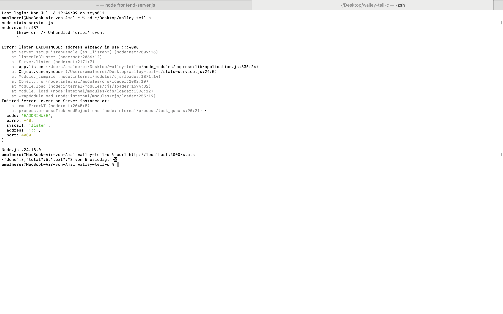
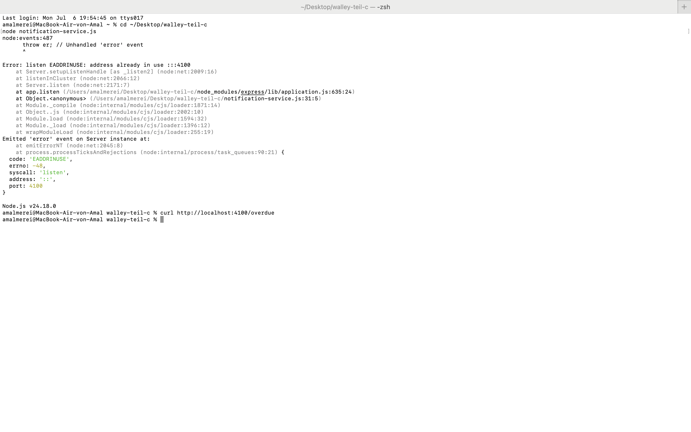
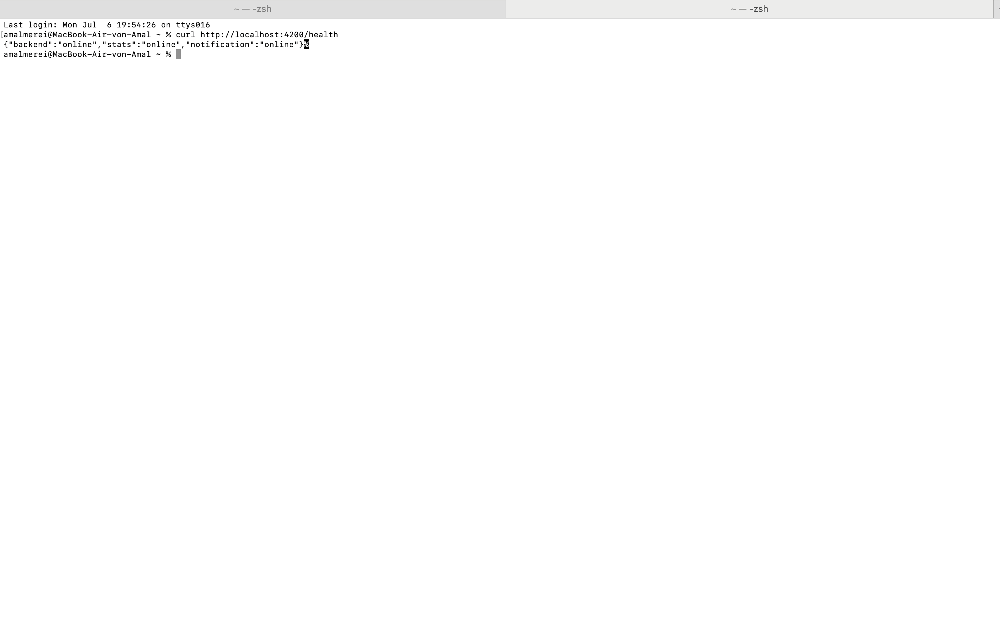

# Teil C – Walley's Pet Task Tracker: Die verteilte Architektur

**Amal Merei · Matrikel 107771 · Softwaretechnik (BHT MIB 20 S26)**

## Überblick

Teil C baut auf der Funktionalität von Teil B (Lovable, React) auf, ersetzt
die dortige rein lokale Speicherung (State/Browser) aber durch eine **echte,
verteilte Architektur** mit dauerhafter Datenspeicherung.

Die App besteht aus **fünf unabhängigen Programmen (Prozessen)**, die jeweils
einzeln gestartet werden müssen und über HTTP-Anfragen miteinander
kommunizieren:

```
┌─────────────────────┐
│  Frontend-Server     │  Port 5050 – liefert die HTML-Oberfläche aus
│  (frontend-server.js)│
└──────────┬───────────┘
           │ HTTP-Anfragen vom Browser aus
           ▼
┌─────────────────────┐        ┌──────────────────────┐
│  Backend             │◄───────│  Stats-Service         │  Port 4000
│  (index.js)          │        │  (stats-service.js)    │  berechnet Fortschritt
│  Port 3000            │        └──────────────────────┘
│  + SQLite-Datenbank   │
│  (walley.db)          │        ┌──────────────────────┐
│                        │◄───────│  Notification-Service │  Port 4100
│                        │        │  (notification-       │  prüft überfällige
│                        │        │   service.js)          │  Aufgaben
└─────────────────────┘        └──────────────────────┘
           ▲                              ▲
           │                              │
           └──────────────┬───────────────┘
                          │
                ┌──────────────────────┐
                │  Health-Service        │  Port 4200
                │  (health-service.js)   │  prüft, ob alle
                └──────────────────────┘  anderen Services laufen
```

**Warum das "verteilt" ist:** Jedes dieser fünf Programme läuft als eigener,
unabhängiger Prozess. Keines der Programme teilt sich Code oder Speicher mit
einem anderen – sie reden ausschließlich über **HTTP-Netzwerkanfragen**
miteinander, genau wie es in einer klassischen verteilten Systemarchitektur
der Fall ist. Wird eines der Programme beendet, laufen die anderen
unabhängig weiter.

---

## Die fünf Module im Detail

### 1. Backend (`index.js`) – Port 3000

Das zentrale Modul. Verwaltet die Aufgaben in einer SQLite-Datenbank
(`walley.db`) und stellt vier HTTP-Routen bereit:

| Route | Zweck |
|---|---|
| `GET /tasks` | alle Aufgaben abrufen |
| `POST /tasks` | neue Aufgabe anlegen |
| `PUT /tasks/:id` | Aufgabe abhaken/zurücksetzen |
| `DELETE /tasks/:id` | Aufgabe löschen |

Jede Aufgabe besitzt: `title`, `completed`, `dueTime`, `category`, `priority`.

**Start:** `node index.js`

Nachweis: Abfrage aller Aufgaben direkt über die Kommandozeile
(`curl http://localhost:3000/tasks`), die zeigt, dass der Server läuft und
echte Daten aus der Datenbank liefert.



---

### 2. Frontend-Server (`frontend-server.js`) – Port 5050

Ein eigenständiger, zweiter Server-Prozess, der ausschließlich die
`frontend.html` (HTML/JavaScript-Oberfläche) an den Browser ausliefert. Dies
ist der entscheidende Unterschied zur ursprünglichen Umsetzung: Das Frontend
ist **kein** lokal geöffnetes Dokument mehr, sondern ein selbst laufendes
Programm, das unabhängig vom Backend gestartet werden muss.

Die HTML-Seite selbst enthält JavaScript, das per `fetch()` HTTP-Anfragen an
Backend, Stats-Service und Notification-Service schickt.

**Start:** `node frontend-server.js`



Die App selbst im Browser, erreichbar unter `http://localhost:5050`:



---

### 3. Stats-Service (`stats-service.js`) – Port 4000

Ein separater Prozess, der **selbst** eine HTTP-Anfrage an das Backend
schickt (`GET http://localhost:3000/tasks`), die Anzahl erledigter Aufgaben
berechnet, und nur das fertige Ergebnis zurückgibt.

Damit übernimmt das Frontend die Fortschrittsberechnung nicht mehr selbst,
sondern bezieht sie von einem dritten, unabhängigen Dienst.

**Start:** `node stats-service.js`

Nachweis über `curl http://localhost:4000/stats`:



---

### 4. Notification-Service (`notification-service.js`) – Port 4100

Prüft ebenfalls über eine eigene Anfrage an das Backend, welche Aufgaben
bereits überfällig sind (Uhrzeit ist vorbei, aber `completed` ist `false`).
Das Ergebnis wird im Frontend als rote Warnung angezeigt.

**Start:** `node notification-service.js`

Nachweis über `curl http://localhost:4100/overdue`:



---

### 5. Health-Service (`health-service.js`) – Port 4200

Fragt bei allen anderen Services (Backend, Stats, Notification) an, ob sie
erreichbar sind, und gibt eine Übersicht zurück. Dies entspricht dem in der
Praxis üblichen Monitoring/Health-Checking verteilter Systeme.

**Start:** `node health-service.js`

Nachweis über `curl http://localhost:4200/health` – zeigt, dass alle drei
überwachten Services gleichzeitig online sind:



---

## Zusammenfassung: Fünf unabhängige, gleichzeitig laufende Prozesse

Die Screenshots oben belegen zusammen, dass alle fünf Module gleichzeitig
und unabhängig voneinander liefen:

- Backend antwortet auf Port 3000 mit echten Datenbankeinträgen
- Frontend-Server liefert die Oberfläche auf Port 5050 aus
- Stats-Service berechnet auf Port 4000 den Fortschritt, indem er selbst
  beim Backend nachfragt
- Notification-Service berechnet auf Port 4100 überfällige Aufgaben,
  ebenfalls durch eigene Anfrage beim Backend
- Health-Service prüft auf Port 4200 den Online-Status aller anderen Dienste

Jeder dieser Prozesse musste einzeln mit einem eigenen `node ...`-Befehl
gestartet werden – es handelt sich um fünf getrennte Programme, nicht um
ein einzelnes Frontend-Backend-Bundle.

---

## Werkzeuge

- **Cursor** (VS-Code-Klon mit KI-Unterstützung) als Hauptwerkzeug für die
  gesamte Entwicklung
- **Claude Code** (CLI) kurz zusätzlich installiert und benutzt, als
  Nachweis für das zweite geforderte Tool (siehe `01-werkzeuge.md`)
- Änderungen an bestehenden Dateien wurden teilweise direkt über das
  Terminal (`sed`-Befehle) vorgenommen, da der Editor-Zugriff über die
  Cursor-Oberfläche wiederholt zu technischen Problemen führte (siehe
  `02-frontend-verbindung.md` für Details zu den aufgetretenen Fehlern und
  deren Lösung)

## Bezug zu Teil B

Die App-Idee und die Kernfunktionalität (Aufgaben mit Titel, Uhrzeit,
Kategorie, Priorität; anlegen, abhaken, löschen) stammen aus Teil B
(Lovable/React). Da sich der originale Lovable-Code aus technischen Gründen
nicht direkt exportieren und weiterverwenden ließ, wurde das Frontend für
Teil C mit einfachem HTML/JavaScript neu umgesetzt – inhaltlich identisch,
aber jetzt über HTTP mit dem eigenen Backend verbunden statt nur im
Browser-Speicher zu arbeiten. Der originale Lovable-Code liegt zur Referenz
in `docs/referenz-teil-b/` (siehe dort).
